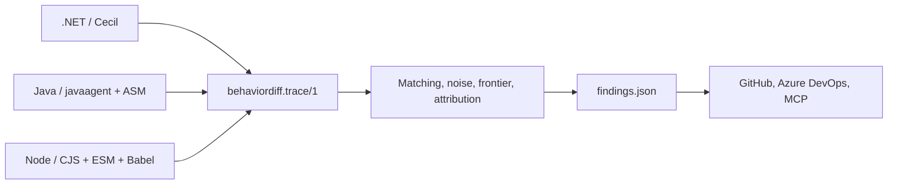
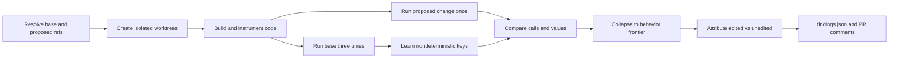

# BehaviorDiff

[](https://github.com/issacnitin/BehaviorDiff/actions/workflows/ci.yml)
[](LICENSE)
[](https://dotnet.microsoft.com/download/dotnet/8.0)

BehaviorDiff finds **runtime behavior changes that ordinary source review misses**.

It builds two Git revisions, observes their tests, learns a noise baseline from three base runs, and reports the first changed behavior in each call tree. A source diff tells you what was edited. BehaviorDiff tells you what the edit did, including effects in files the pull request never touched.

The architecture has one language-neutral engine and one tracer per runtime:



[`TRACE-FORMAT.md`](TRACE-FORMAT.md) is the contract between tracers and the engine. Java and Node were implemented independently from that contract and pass the same conformance harness: identical method sets, per-key event counts and entry ordinals, source tripwires, digest proofs, and zero engine divergences.

> Status: early preview. The CLI detects .NET, Maven Java, and npm Node repositories from their root build entry points.

## Supported languages

| Language | Instrumentation | Test/source integration | Current limits |
| --- | --- | --- | --- |
| .NET 8 | Mono.Cecil build-time IL weaving | xUnit and portable PDBs | Properties, events, operators, and type initializers are skipped by policy. |
| Java | `java.lang.instrument` agent with ASM | Maven, JUnit/TestNG annotations, `src/main/java` and `src/test/java` | Conventional Maven roots are required; static initializers are skipped; collection shape rules require `java.util` module access. |
| Node / TypeScript | CommonJS require hook and ESM loader with Babel | npm, direct JavaScript locations, TypeScript source maps, Jest/Vitest adapters | npm/package-lock only; workers are out of scope; generators and unsupported callables are skipped; source maps must resolve rather than be guessed. |

Every tracer emits the same process-scoped NDJSON contract and a reconciled coverage manifest. A member reported instrumented must be capable of emitting, and every module must satisfy `discovered = instrumented + skipped` with zero patch failures.

## Why use it?

A harmless-looking refactor can change behavior far from the edited file:

```diff
 public static List<T> ByPriority<T>(
     this IEnumerable<T> src,
-    Func<T, int> key)
-{
-    var list = src.ToList();
-    list.Sort((a, b) => key(a).CompareTo(key(b)));
-    return list;
-}
+    Func<T, int> key) => src.OrderBy(key).ToList();
```

`List.Sort` is not stable; `OrderBy` is. In the included demo, that one-line infrastructure change alters an unedited pricing engine:

```text
BehaviorDiff: 1 behavior gap outside this diff

DiscountEngine.SelectDiscount returned "CLEARANCE_40",
now returns "SEASONAL_15".

CheckoutTotals.Compute returned 60, now returns 85.
2 of the 3 tests that executed this did not assert on the change.
```

The edited helper is in `Infrastructure.Collections`; the observed effect is in `Commerce.Pricing`. See the live [demo pull request](https://github.com/issacnitin/behaviordiff-live-verification/pull/4) and its [successful hosted run](https://github.com/issacnitin/behaviordiff-live-verification/actions/runs/32369192452).

## Five-minute .NET demo

Prerequisites for this .NET demo: Git, .NET 8 SDK, and PowerShell 7. Java analysis additionally requires a JDK and Maven; Node analysis requires Node.js and npm.

```powershell
git clone https://github.com/issacnitin/BehaviorDiff.git
cd BehaviorDiff
dotnet build BehaviorDiff.sln -c Release
pwsh -File tools/verify-diff.ps1 -Mutate -Change sort
```

The proof creates a temporary proposed-change tree, changes only `SortingExtensions.cs`, runs the base twice plus the change once, and writes `findings.json`. It verifies:

- the edited file contributes zero traced members;
- the frontier is `Commerce.Pricing.DiscountEngine.SelectDiscount` in an unedited project;
- two call sites changed without an assertion reacting;
- five diverged keys collapse to three frontier nodes;
- the equal-priority selection is deterministic across fresh processes.

Run all maintained demo modes:

```powershell
pwsh -File tools/verify-demo-fixtures.ps1
```

This covers sort stability, retry policy, and configuration parsing.

## Install the CLI

### Install the GitHub release

Download the package from the [latest release](https://github.com/issacnitin/BehaviorDiff/releases/latest), then install it from the download directory:

```powershell
dotnet tool install --global BehaviorDiff.Tool `
  --version 0.1.0 `
  --add-source .

behaviordiff --help
```

The package is attached as `BehaviorDiff.Tool.0.1.0.nupkg`.

### Build and install from source

```powershell
git clone https://github.com/issacnitin/BehaviorDiff.git
cd BehaviorDiff
pwsh -File tools/package-cli.ps1
dotnet tool install --global BehaviorDiff.Tool `
  --add-source ./artifacts/packages
behaviordiff --help
```

The packaging wrapper builds and stages the shaded Java agent and the Node tracer with its production dependencies before passing `CrossLanguageTracerRoot` to `dotnet pack`. An ordinary `dotnet build` remains independent of Maven and npm.

To update an existing source installation:

```powershell
dotnet tool update --global BehaviorDiff.Tool `
  --add-source ./artifacts/packages
```

You can also run the built DLL directly:

```powershell
dotnet build src/BehaviorDiff.Cli/BehaviorDiff.Cli.csproj -c Release
dotnet src/BehaviorDiff.Cli/bin/Release/net8.0/behaviordiff.dll --help
```

## Run an analysis

BehaviorDiff needs a repository path and two Git refs. The target repository must build in the current environment.

```powershell
behaviordiff C:\src\my-service `
  --base origin/main `
  --pr HEAD `
  --findings C:\temp\behaviordiff\findings.json
```

Useful options:

```text
--work <directory>      Override the temporary work directory
--findings <file>       Write canonical machine-readable findings
--keep                  Keep worktrees and traces for investigation
--ci=github             Resolve refs from a GitHub pull_request event
--ci=azuredevops        Resolve refs from Azure Pipelines variables
```

Exit codes:

| Code | Meaning |
| ---: | --- |
| 0 | Analysis completed; no unexpected behavior changes |
| 1 | Analysis completed; behavior findings exist |
| 3 | Analysis refused because the evidence could not support a verdict |
| 4 | BehaviorDiff could not instrument the repository |
| 5 | The unmodified repository did not build in this environment |

Exit `3` is deliberately different from clean. BehaviorDiff refuses when path attribution, source information, call-tree integrity, or coverage is insufficient.

### .NET

Prerequisites: .NET 8 SDK. The repository must contain an SDK-style solution/project and xUnit tests using `Microsoft.NET.Test.Sdk`.

```powershell
behaviordiff C:\src\dotnet-service --base origin/main --pr HEAD
```

### Java

Prerequisites: a JDK and Maven (or a Maven wrapper). The CLI derives package scope, attaches the packaged Java agent, and maps class output to conventional Maven source roots.

```powershell
behaviordiff C:\src\java-service --base origin/main --pr HEAD
```

### Node and TypeScript

Prerequisites: Node.js, npm, `package-lock.json`, and a test script. TypeScript must emit usable source maps. Jest/Vitest callbacks must use the included adapters so the tracer can open structural test roots; an insufficiently correlated run is refused.

```powershell
behaviordiff C:\src\node-service --base origin/main --pr HEAD
```

The command is intentionally the same for every language. `behaviordiff detect-language <repo>` shows the selected language and build entry point.

## Read the result

`findings.json` is the stable integration surface. A condensed example:

```json
{
  "status": "analyzed",
  "verdict": "findings",
  "summary": {
    "unexpectedMembers": 1,
    "unexpectedCallSites": 3,
    "editedFiles": 1,
    "exercisedEditedFiles": 0
  },
  "members": [
    {
      "memberName": "Commerce.Pricing.DiscountEngine.SelectDiscount(System.Decimal)",
      "attribution": "unexpected",
      "distinctTestCount": 3,
      "untestedCallSiteCount": 2,
      "assertionReactionSummary": "3 tests executed this; 1 test had an assertion react."
    }
  ]
}
```

Key concepts:

- **Expected**: behavior changed in an edited file.
- **Unexpected**: behavior changed in a file outside the source diff.
- **Behavior gap**: at least one executing test did not react to the changed behavior.
- **Test-covered change**: every executing test reacted. It is recorded as evidence, not framed as an unasserted breakage.
- **Frontier**: the lowest changed member whose compared descendants are unchanged. Changed callers above it are collateral and suppressed.
- **Coverage**: every edited file reports traced members, call sites, and calls. Zero means not observed, never “unchanged.”

## GitHub Actions

The repository includes two workflows:

- [CI](.github/workflows/ci.yml) builds, runs executable proofs, and packs the CLI.
- [BehaviorDiff blast radius](.github/workflows/blastradius.yml) analyzes pull requests, uploads `findings.json`, and posts comments for same-repository PRs.

For your own repository, copy `blastradius.yml` and adjust namespace exclusions if needed. The workflow uses immutable pull-request SHAs and full Git history.

BehaviorDiff anchors a cause comment on the changed hunk and links to the affected unedited source. GitHub does not allow a review comment directly on a file absent from the PR diff.

Fork pull requests are analyzed without posting because GitHub supplies a read-only token. The machine-readable artifact remains available.

## Azure Pipelines

[azure-pipelines.yml](azure-pipelines.yml) provides the equivalent Azure Repos flow. Add it as a **Build validation** branch policy; Azure Repos does not honor YAML `pr` triggers.

```text
behaviordiff <repo> --ci=azuredevops --findings findings.json
behaviordiff post --provider=azuredevops --findings findings.json
```

The default posting gate is `warn-only`. Switch to `fail-on-findings` only after validating the signal on your repository.

## Optional grounded explanations

Deterministic findings never depend on a model. A trusted posting process may set `ANTHROPIC_API_KEY` to request an explanation constrained to exact observations, call paths, consequences, and diff citations.

Do not expose a persistent model credential to a job that builds untrusted pull-request code. The included GitHub workflow intentionally does not use one. Missing, rejected, or unavailable model output never changes the deterministic result.

## How it works



1. **Language instrumentation**: Mono.Cecil weaves .NET IL, a `java.lang.instrument` agent rewrites JVM bytecode with ASM, and Node load hooks transform CommonJS/ESM functions with Babel.
2. **Runtime capture**: arguments, return values, exceptions, call order, source locations, and test roots are recorded as NDJSON.
3. **Noise baseline**: differences found among base runs are excluded from proposed-change evidence.
4. **Frontier analysis**: changed callers are collapsed onto the first changed behavior in each call tree.
5. **Assertion reaction**: a changed test-root trace indicates that an assertion reacted; unchanged test roots identify partial or missing oracles.
6. **Honest refusal**: incomplete evidence produces a non-verdict rather than a false clean result.

## Honest limitations

BehaviorDiff analyzes executed behavior, not all possible behavior. It complements static analysis and review; it does not replace either.

- unexecuted methods have no runtime evidence;
- .NET type initializers are skipped to avoid CLR initialization-lock deadlocks;
- .NET properties, events, and operators are skipped by the current scope policy;
- Java static initializers and Node generators or unsupported callable shapes are recorded as skipped coverage boundaries;
- Node worker threads are out of scope in version 1 and are recorded as `UnsupportedShape` boundaries rather than silently omitted;
- Node `Map` and `Set` internals cannot be read without iteration, so they are represented by explicit partial markers;
- generated members without a real repository source path cannot be attributed through a normal Git diff;
- three base runs sample nondeterminism; they do not characterize every possible schedule or external dependency;
- identical partial digests do not prove equality inside skipped, depth-limited, errored, or truncated regions;
- traces can contain application values and should be handled as sensitive build artifacts;
- target tests execute with the permissions of the CI agent; BehaviorDiff is not a sandbox.

See [evidence/FINDINGS.md](evidence/FINDINGS.md) for measured instrumentation and scale results.

## Repository layout

| Path | Purpose |
| --- | --- |
| `src/BehaviorDiff.Cli` | Repository orchestration and PR providers |
| `src/BehaviorDiff.Engine` | Matching, noise filtering, frontier analysis, findings |
| `src/BehaviorDiff.Tracer` | Runtime hooks, value rendering, coverage manifests |
| `src/BehaviorDiff.Java.Agent` | Java agent, ASM rewriting, JVM canonicalizer |
| `src/BehaviorDiff.Node` | CommonJS/ESM hooks, Babel rewriting, Node canonicalizer and test adapters |
| `src/BehaviorDiff.Contracts` | Trace and manifest wire formats |
| `src/BehaviorDiff.Mcp` | Optional MCP server over completed runs |
| `tools/Weaver` | Mono.Cecil build-time instrumentation |
| `samples/` and `src/Commerce.Pricing` | Executable behavior-diff fixtures |
| `tools/verify-*.ps1` | End-to-end executable proofs |

## Contributing and security

Contributions are welcome. Start with [CONTRIBUTING.md](CONTRIBUTING.md), follow [CODE_OF_CONDUCT.md](CODE_OF_CONDUCT.md), and report vulnerabilities according to [SECURITY.md](SECURITY.md).

See [CHANGELOG.md](CHANGELOG.md) for release history. BehaviorDiff is licensed under the [MIT License](LICENSE).
