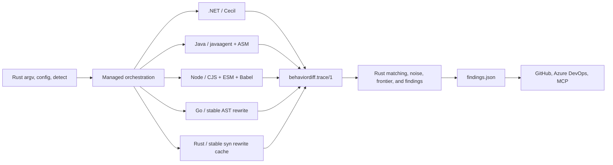
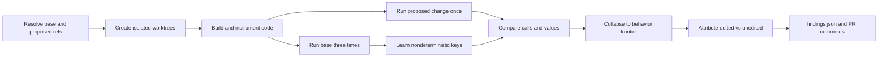

# BehaviorDiff

[](https://github.com/issacnitin/BehaviorDiff/actions/workflows/ci.yml)
[](LICENSE)
[](https://dotnet.microsoft.com/download/dotnet/8.0)

BehaviorDiff finds **runtime behavior changes that ordinary source review misses**.

It builds two Git revisions, observes their tests, learns a noise baseline from three base runs, and reports the first changed behavior in each call tree. A source diff tells you what was edited. BehaviorDiff tells you what the edit did, including effects in files the pull request never touched.

The public executable is a thin Rust launcher that owns argument routing, repository config loading, and `detect`. It starts a sibling self-contained managed component for ref resolution, builds, caches, instrumentation, and posting. The architecture then has one language-neutral trace contract, one tracer per runtime, and a single-pass streaming Rust diff, frontier, and findings engine:



[`TRACE-FORMAT.md`](TRACE-FORMAT.md) is the contract between tracers and the engine. The maintained .NET, Java, Node, Go, and Rust gates apply the same conformance rules: identical method sets, per-key event counts and entry ordinals, source tripwires, digest proofs, and zero engine divergences from non-empty runs.

> Status: early preview. The unified CLI detects .NET, Maven Java, npm Node, Go modules, and Cargo Rust repositories from their root build entry points.

## Supported languages

| Language | Instrumentation | Test/source integration | Current limits |
| --- | --- | --- | --- |
| .NET 8 | Mono.Cecil build-time IL weaving | xUnit and portable PDBs | Properties, events, operators, and type initializers are skipped by policy. |
| Java | `java.lang.instrument` agent with ASM | Maven, JUnit/TestNG annotations, `src/main/java` and `src/test/java` | Conventional Maven roots are required; static initializers are skipped; collection shape rules require `java.util` module access. |
| Node / TypeScript | CommonJS require hook and ESM loader with Babel | npm, direct JavaScript locations, TypeScript source maps, Jest/Vitest adapters | npm/package-lock only; workers are out of scope; generators and unsupported callables are skipped; source maps must resolve rather than be guessed. |
| Go | Stable module-aware AST rewriting into a build cache | `go test`, original `.go` parser positions | Dynamic interface/function boundaries and unrewritten goroutine boundaries are explicit skips. |
| Rust | Stable `syn`/`quote` rewriting into a SHA-256 build cache | `cargo test`, structural `#[test]` roots, original `.rs` parser positions | Macro expansions, extern/const callables, unions, trait objects, and dependency values are explicit partial/unsupported boundaries; rendered-value redaction is not yet implemented. |

Every tracer emits the same process-scoped NDJSON contract and a reconciled coverage manifest. A member reported instrumented must be capable of emitting, and every module must satisfy `discovered = instrumented + skipped` with zero patch failures.

## Why use it?

A harmless-looking refactor can change behavior far from the edited file:

```diff
 public static List<T> ByPriority<T>(
     this IEnumerable<T> src,
-    Func<T, int> key)
-{
-    var list = src.ToList();
-    list.Sort((a, b) => key(a).CompareTo(key(b)));
-    return list;
-}
+    Func<T, int> key) => src.OrderBy(key).ToList();
```

`List.Sort` is not stable; `OrderBy` is. In the included demo, that one-line infrastructure change alters an unedited pricing engine:

```text
BehaviorDiff: 1 behavior gap outside this diff

DiscountEngine.SelectDiscount returned "CLEARANCE_40",
now returns "SEASONAL_15".

CheckoutTotals.Compute returned 60, now returns 85.
2 of the 3 tests that executed this did not assert on the change.
```

The edited helper is in `Infrastructure.Collections`; the observed effect is in `Commerce.Pricing`. See the live [demo pull request](https://github.com/issacnitin/behaviordiff-live-verification/pull/4) and its [successful hosted run](https://github.com/issacnitin/behaviordiff-live-verification/actions/runs/32369192452).

## Five-minute .NET demo

Prerequisites for this .NET demo: Git, .NET 8 SDK, and PowerShell 7. Java analysis additionally requires a JDK and Maven; Node analysis requires Node.js and npm.

```powershell
git clone https://github.com/issacnitin/BehaviorDiff.git
cd BehaviorDiff
dotnet build BehaviorDiff.sln -c Release
pwsh -File tools/verify-diff.ps1 -Mutate -Change sort
```

The proof creates a temporary proposed-change tree, changes only `SortingExtensions.cs`, runs the base twice plus the change once, and writes `findings.json`. It verifies:

- the edited file contributes zero traced members;
- the frontier is `Commerce.Pricing.DiscountEngine.SelectDiscount` in an unedited project;
- two call sites changed without an assertion reacting;
- five diverged keys collapse to three frontier nodes;
- the equal-priority selection is deterministic across fresh processes.

Run all maintained demo modes:

```powershell
pwsh -File tools/verify-demo-fixtures.ps1
```

This covers sort stability, retry policy, and configuration parsing.

## Install the CLI

### Use the all-language container

The published Linux image contains the BehaviorDiff CLI, default Rust diff engine, .NET 8 SDK/tracer, Java 17 agent, Node 24 tracer, Go rewriter, and stable Rust toolchain/tracer. The host needs only Docker:

```bash
docker pull ghcr.io/issacnitin/behaviordiff:main
docker run --rm \
  --volume "$PWD:/workspace" \
  ghcr.io/issacnitin/behaviordiff:main \
  /workspace --base origin/main --pr HEAD \
  --findings /workspace/.behaviordiff/artifacts/findings.json
```

The normal image entrypoint is `behaviordiff`; no PowerShell wrapper is involved. The unified CLI orchestrates .NET, Java, Node/TypeScript, Go, and Rust repositories.

The current locally verified Linux/amd64 image is 898,678,469 bytes by Docker image inspection and includes stable Rust 1.98 plus a native linker. The container workflow reports the exact size for every published build.

### Install the GitHub release

Download the archive for `linux-x64`, `linux-arm64`, `darwin-arm64`, `darwin-x64`, or `win-x64` from the [latest release](https://github.com/issacnitin/BehaviorDiff/releases/latest). Verify it against `SHA256SUMS`, extract it, and place the extracted directory on `PATH`. The executable is self-contained; the host does not need a .NET runtime.

```bash
sha256sum --check SHA256SUMS --ignore-missing
tar -xzf behaviordiff-v0.2.0-linux-x64.tar.gz -C "$HOME/.local/lib/behaviordiff"
ln -s "$HOME/.local/lib/behaviordiff/behaviordiff" "$HOME/.local/bin/behaviordiff"
behaviordiff --help
```

```powershell
Get-FileHash .\behaviordiff-v0.2.0-win-x64.zip -Algorithm SHA256
Expand-Archive .\behaviordiff-v0.2.0-win-x64.zip "$env:LOCALAPPDATA\BehaviorDiff"
& "$env:LOCALAPPDATA\BehaviorDiff\behaviordiff.exe" --help
```

The complete extracted directory must remain together because the Rust `behaviordiff` launcher starts `behaviordiff-managed` beside it and the directory also contains the native engine, language tracers, and separately launched .NET Weaver. The NuGet tool package remains available as a framework-dependent managed compatibility distribution:

```powershell
dotnet tool install --global BehaviorDiff.Tool --version 0.2.0 --add-source .
behaviordiff --help
```

### Build and install from source

```powershell
git clone https://github.com/issacnitin/BehaviorDiff.git
cd BehaviorDiff
pwsh -File tools/package-cli.ps1
dotnet tool install --global BehaviorDiff.Tool `
  --add-source ./artifacts/packages
behaviordiff --help
```

The packaging wrapper builds and stages the shaded Java agent, Node tracer with production dependencies, stable Rust tracer for the current RID, and current host's Rust diff engine before packing the tool. An ordinary `dotnet build` remains independent of Maven, npm, and Cargo.

To update an existing source installation:

```powershell
dotnet tool update --global BehaviorDiff.Tool `
  --add-source ./artifacts/packages
```

You can also run the built DLL directly:

```powershell
dotnet build src/BehaviorDiff.Cli/BehaviorDiff.Cli.csproj -c Release
dotnet src/BehaviorDiff.Cli/bin/Release/net8.0/behaviordiff.dll --help
```

## Run an analysis

BehaviorDiff needs a repository path and two Git refs. The target repository must build in the current environment.

```powershell
behaviordiff C:\src\my-service `
  --base origin/main `
  --pr HEAD `
  --findings C:\temp\behaviordiff\findings.json
```

Useful options:

```text
--work <directory>      Override the temporary work directory
--findings <file>       Write canonical machine-readable findings
--cache-dir <directory> Override the local base-trace cache directory
--cache-retention <n>    Expire cached traces after a stated window, for example 12h or 7d
--keep-traces <n>        Opt in to retaining working traces for a stated window
--keep                  Keep temporary Git worktrees; traces are still deleted by default
--ci=github             Resolve refs from a GitHub pull_request event
--ci=azuredevops        Resolve refs from Azure Pipelines variables
```

The streaming Rust engine implements trace loading, matching, noise filtering, divergence construction, frontier detection, attribution, baseline suppression, and findings generation. `BEHAVIORDIFF_RUST_ENGINE` can override the packaged native executable for development diagnostics.

PR comments use a high-confidence policy by default. A finding is high-confidence only when its frontier is verified, every compared digest is exact, an ancestor or descendant divergence connects it to the change through the call tree, and the same member showed no baseline-run or manifest nondeterminism. An edited file contributing zero traced members does not by itself disqualify the finding. Every finding remains in `findings.json` with `confidence`, `confidenceFactors`, `nondeterminism`, and `commentSuppressionReasons`; comments show how many lower-confidence findings were retained only in the artifact. Pass `--strict` to include all unsuppressed findings in comments. The GitHub Action exposes the same behavior through `strict: 'true'`, and Azure Pipelines through `behaviorDiffStrict: 'true'`.

Exit codes:

| Code | Meaning |
| ---: | --- |
| 0 | Analysis completed; no unexpected behavior changes |
| 1 | Analysis completed; behavior findings exist |
| 3 | Analysis refused because the evidence could not support a verdict |
| 4 | BehaviorDiff could not instrument the repository |
| 5 | The unmodified repository did not build in this environment |

Exit `3` is deliberately different from clean. BehaviorDiff refuses when path attribution, source information, call-tree integrity, or coverage is insufficient.

### .NET

Prerequisites: .NET 8 SDK. The repository must contain an SDK-style solution/project and xUnit tests using `Microsoft.NET.Test.Sdk`.

```powershell
behaviordiff C:\src\dotnet-service --base origin/main --pr HEAD
```

### Java

Prerequisites: a JDK and Maven (or a Maven wrapper). The CLI derives package scope, attaches the packaged Java agent, and maps class output to conventional Maven source roots.

```powershell
behaviordiff C:\src\java-service --base origin/main --pr HEAD
```

### Node and TypeScript

Prerequisites: Node.js, npm, `package-lock.json`, and a test script. TypeScript must emit usable source maps. Jest/Vitest callbacks must use the included adapters so the tracer can open structural test roots; an insufficiently correlated run is refused.

```powershell
behaviordiff C:\src\node-service --base origin/main --pr HEAD
```

### Go

Prerequisites: stable Go and standard `go test` tests. The CLI rewrites source only into an external cache, runs the configured tests there, and maps events back to the original `.go` files. The checkout is never mutated.

```powershell
behaviordiff C:\src\go-service --base origin/main --pr HEAD
```

### Rust

Prerequisites: stable Rust/Cargo and standard `#[test]` tests. The CLI rewrites only into an external content-addressed cache, runs tests there, and maps events back to original `.rs` files. The checkout is never mutated. Do not use the Rust tracer for sensitive values yet: digest capture is qualified, but rendering-only secret redaction remains incomplete.

```powershell
behaviordiff C:\src\rust-service --base origin/main --pr HEAD
```

The command is intentionally the same for every language. `behaviordiff detect <repo>` prints the effective language, work directory, entry point, commands, test projects, and scope. The legacy `detect-language` spelling remains an alias.

### Repository configuration

Add `.behaviordiff/config.yml` when inference is incomplete or the repository uses custom commands:

```yaml
language: node
workdir: services/api
build: npm ci && npm run build
test: npm test
test_projects:
  - tests/Api.Tests/Api.Tests.csproj
include_namespaces:
  - src
exclude_namespaces:
  - src/generated
redaction:
  names:
    - customer_password
  types:
    - SecretEnvelope
  paths:
    - generated
baseline:
  schema: behaviordiff.baseline/2
  acknowledgements: []
  ignorePaths: []
  ignoreMembers: []
```

Configuration overrides inference field by field; detection fills fields left unset. `workdir` must remain inside the repository. `test_projects` selects .NET test projects by repository-relative glob. Include/exclude values augment tracing scope, redaction values augment the corresponding environment rules, and the nested baseline uses the same schema as `.behaviordiff/baseline.yml`.

The effective build and test commands run unchanged for both base and PR revisions. Custom tests do not replace instrumentation: .NET receives the woven/injected environment, Java receives the javaagent through `JAVA_TOOL_OPTIONS`, Node receives the loader/hooks through `NODE_OPTIONS`, and Go/Rust tests execute in their rewritten caches. A command that exits successfully but produces zero trace events is refused with exit `3` and reports the command and trace/manifest counts.

Automatic detection recognizes conventional root or unambiguous nested `.sln`/`.csproj`, Maven `pom.xml`, npm `package.json`, Go `go.mod`, and Cargo `Cargo.toml` entry points. Java detection is Maven-only, Node detection requires npm and `package-lock.json` for execution, and source/test roots remain conventional. Mixed-language repositories, monorepos, and multiple entry points are refused rather than guessed; set `language` and `workdir` (plus both commands when no conventional entry point exists) to resolve them.

### Base trace cache

BehaviorDiff caches the three validated noise-baseline traces when `--cache-dir` is supplied. Persistence is opt-in. The key contains the target SHA, language, a content fingerprint of the installed tracer, and the effective scope/redaction configuration. A tracer, scope, or redaction change therefore cannot reuse stale evidence. The storage boundary is pluggable; this release includes the local-directory backend, which can be placed on a CI-native or S3-compatible mounted cache. Entries expire after one day by default; use `--cache-retention` to state a different window.

On a hit, PR analysis restores the three baseline samples and performs only the PR instrumented run. A missing, malformed, or unavailable cache entry is reported as a miss and falls back to the existing four-run path. The console and `findings.json.baseTraceCache` report `hit`, `miss`, or `disabled`, the cache key/backend, and measured baseline wall-clock time saved.

On the 99,000-event-per-run FluentValidation scale case, a cold four-run analysis took 339.705 seconds and the subsequent cache-hit analysis took 53.962 seconds: an 84.1% reduction, or 6.3 times faster. The warm run spent 13.264 seconds building, 2.729 seconds weaving, 11.844 seconds in its single instrumented run, 10.386 seconds diffing, and 6.503 seconds finding the frontier. These are measurements from one Windows development machine, not performance guarantees; full methodology and the cold-run breakdown are in [evidence/FINDINGS.md](evidence/FINDINGS.md).

Every analyzed `findings.json` includes `timings` for build, weave, instrumented runs, cache restore/store, engine diff, engine frontier, and their measured total. This makes CI cost visible without parsing console output.

On retained FluentValidation #2136, the default Rust path measured 6.626 seconds cold and 7.331 seconds warm across diff plus shared frontier, with 321.410/314.102 MiB host process-tree peaks. C# measured 13.685/14.037 seconds and 2,130.137/2,155.504 MiB. Full methodology, byte-equivalence gates, and container measurements are in [evidence/RUST-STREAMING-KILL-GATE.md](evidence/RUST-STREAMING-KILL-GATE.md) and [evidence/CONTAINER-PROOF.md](evidence/CONTAINER-PROOF.md).

Warm a target branch from a nightly job without running a synthetic PR comparison:

```powershell
behaviordiff warm C:\src\my-service --target origin/main --cache-dir C:\ci-cache\behaviordiff
```

### Suppression baseline

BehaviorDiff automatically applies `.behaviordiff/baseline.yml` from the analyzed repository. Suppression is a policy projection: every raw member and the original `unexpectedMembers` count remain in `findings.json`, while matched members receive `suppression` metadata and additive actionable/suppressed counts control process and posting gates. Use `--no-baseline` to inspect the raw result or `--baseline <file>` for a nonstandard path.

Write or merge 30-day acknowledgements for every currently actionable member in one command:

```bash
behaviordiff baseline write --findings .behaviordiff/artifacts/findings.json
```

Use `--expires 90d` to choose another window or `--no-expiry` for permanent policy. Re-running the command is idempotent and adds only actionable members not already acknowledged.

```yaml
schema: behaviordiff.baseline/2
acknowledgements:
  - id: accepted-pricing-change
    member: Commerce.Pricing.DiscountEngine.SelectDiscount(System.Decimal)
    path: src/Commerce.Pricing/DiscountEngine.cs
    baseDigest: 'sha256:4ce90f...'
    prDigest: 'sha256:809af1...'
    reason: Approved pricing migration
    expires: 2026-09-30
ignorePaths:
  - id: generated-sources
    pattern: '**/generated/**'
    reason: Generated files are reviewed through their source templates
ignoreMembers:
  - id: legacy-cache
    pattern: Legacy.Cache.*
    reason: Known nondeterministic legacy cache
```

Rule IDs must be unique. Acknowledgements match an exact member, path, and base/PR behavior-digest pair; changing either observed behavior resurfaces the finding. Deliberately broad path and member ignores are syntactically separate and use case-sensitive `*`, `**`, and `?` globs. An expiry before the current UTC date disables the rule. Active rules matching no current member/path are stale; acknowledgements whose member/path still exists but whose digest pair no longer matches are reported separately as changed behavior in `findings.json.baseline.digestMismatchEntries` and PR summaries. Provider comments show suppressed member/call-site counts and link to the committed baseline.

## Trace security and threat model

Trace events contain method identities, source locations, test identities, call topology, and canonicalized argument and return values. Those values can include credentials, personal data, and business-sensitive state. Treat an unredacted trace as sensitive build output.

Redaction is on by default. Names matching `password`, `token`, `secret`, `key`, `ssn`, `email`, `auth`, or `credential` render as `<redacted>`. Credential-shaped strings such as JWTs, AWS access-key IDs, PEM headers, and long base64 runs are also redacted. Add name patterns with `BEHAVIORDIFF_REDACT_NAMES`, whole runtime types with `BEHAVIORDIFF_REDACT_TYPES`, and repository directory prefixes with `BEHAVIORDIFF_REDACT_PATHS`; lists use commas or semicolons. Types and paths are still digested but never rendered.

Redaction does not weaken comparison: SHA-256 digests are computed from the complete real canonical value before display redaction. Consequently, two different secrets still produce a behavior divergence even when both sides display `<redacted>`. Redaction does not hide method names, source paths, test names, object shape, non-matching values, exception types, digest equality, or the fact that a sensitive value changed. Name rules also depend on names retained by source/compiler metadata, so content, type, and path rules should protect contexts where names may be stripped.

Working traces are deleted after analysis by default; `findings.json` persists. `--keep` retains worktrees but not traces. Diagnostic retention requires `--keep-traces 12h` (or another explicit hours/days window), which writes `trace-retention.json` with the expiry; later CLI runs prune expired sibling work directories. Base-trace caching is separately opt-in with `--cache-dir` and an explicit/default cache retention window. CI storage lifecycle policy remains the enforcement boundary after a retained work directory or cache directory is uploaded elsewhere.

## Read the result

`findings.json` is the stable integration surface. A condensed example:

```json
{
  "status": "analyzed",
  "verdict": "findings",
  "summary": {
    "unexpectedMembers": 1,
    "unexpectedCallSites": 3,
    "editedFiles": 1,
    "exercisedEditedFiles": 0
  },
  "members": [
    {
      "memberName": "Commerce.Pricing.DiscountEngine.SelectDiscount(System.Decimal)",
      "attribution": "unexpected",
      "distinctTestCount": 3,
      "untestedCallSiteCount": 2,
      "assertionReactionSummary": "3 tests executed this; 1 test had an assertion react."
    }
  ]
}
```

Key concepts:

- **Expected**: behavior changed in an edited file.
- **Unexpected**: behavior changed in a file outside the source diff.
- **Behavior gap**: at least one executing test did not react to the changed behavior.
- **Test-covered change**: every executing test reacted. It is recorded as evidence, not framed as an unasserted breakage.
- **Frontier**: the lowest changed member whose compared descendants are unchanged. Changed callers above it are collateral and suppressed.
- **Coverage**: every edited file reports traced members, call sites, and calls. Zero means not observed, never “unchanged.”

## GitHub Actions

Use the published Docker Action after a full-history checkout:

```yaml
permissions:
  contents: read
  pull-requests: write

steps:
  - uses: actions/checkout@v4
    with:
      fetch-depth: 0
  - uses: issacnitin/BehaviorDiff@main
    env:
      GITHUB_TOKEN: ${{ github.token }}
```

It writes `.behaviordiff/artifacts/findings.json`, restores or updates `.behaviordiff/cache`, and posts with the `warn-only` gate by default. Inputs expose the work, findings, cache, retention, gate, and posting settings.

This repository includes three workflows:

- [CI](.github/workflows/ci.yml) builds, runs executable proofs, and packs the CLI.
- [Container](.github/workflows/container.yml) builds the single image, proves full Node and Java analysis on Linux with Docker as the only host prerequisite, reports image size, and publishes commit and channel tags to GHCR.
- [BehaviorDiff blast radius](.github/workflows/blastradius.yml) analyzes pull requests, uploads `findings.json`, and posts comments for same-repository PRs.

For your own repository, copy `blastradius.yml` and adjust namespace exclusions if needed. The workflow uses immutable pull-request SHAs and full Git history.

BehaviorDiff anchors a cause comment on the changed hunk and links to the affected unedited source. GitHub does not allow a review comment directly on a file absent from the PR diff.

Fork pull requests are analyzed without posting because GitHub supplies a read-only token. The machine-readable artifact remains available.

## Azure Pipelines

[azure-pipelines.yml](azure-pipelines.yml) provides the equivalent Azure Repos container job. It pulls the same all-language image and runs only Bash and native commands; the hosted agent does not install .NET, Java, Node, Go, Maven, npm, or PowerShell for BehaviorDiff. Add it as a **Build validation** branch policy; Azure Repos does not honor YAML `pr` triggers.

```text
behaviordiff <repo> --ci=azuredevops --findings findings.json
behaviordiff post --provider=azuredevops --findings findings.json
```

The default posting gate is `warn-only`. Switch to `fail-on-findings` only after validating the signal on your repository.

## Optional grounded explanations

Deterministic findings never depend on a model. A trusted posting process may set `ANTHROPIC_API_KEY` to request an explanation constrained to exact observations, call paths, consequences, and diff citations.

Do not expose a persistent model credential to a job that builds untrusted pull-request code. The included GitHub workflow intentionally does not use one. Missing, rejected, or unavailable model output never changes the deterministic result.

## How it works



1. **Language instrumentation**: Mono.Cecil weaves .NET IL; Java uses an ASM agent; Node uses Babel load hooks; Go and Rust use stable source rewriting into external build caches.
2. **Runtime capture**: arguments, return values, exceptions, call order, source locations, and test roots are recorded as NDJSON.
3. **Noise baseline**: differences found among base runs are excluded from proposed-change evidence.
4. **Frontier analysis**: changed callers are collapsed onto the first changed behavior in each call tree.
5. **Assertion reaction**: a changed test-root trace indicates that an assertion reacted; unchanged test roots identify partial or missing oracles.
6. **Honest refusal**: incomplete evidence produces a non-verdict rather than a false clean result.

## Honest limitations

BehaviorDiff analyzes executed behavior, not all possible behavior. It complements static analysis and review; it does not replace either.

- unexecuted methods have no runtime evidence;
- .NET type initializers are skipped to avoid CLR initialization-lock deadlocks;
- .NET properties, events, and operators are skipped by the current scope policy;
- Java static initializers and Node generators or unsupported callable shapes are recorded as skipped coverage boundaries;
- Node worker threads are out of scope in version 1 and are recorded as `UnsupportedShape` boundaries rather than silently omitted;
- Node `Map` and `Set` internals cannot be read without iteration, so they are represented by explicit partial markers;
- Rust opaque/generic/trait-object/union regions and unavailable macro expansions are explicit partial or unsupported boundaries;
- Rust rendered values do not yet apply the TRACE-FORMAT sensitive-name/content redaction rules; use only with non-sensitive test values until that confidentiality blocker is closed;
- generated members without a real repository source path cannot be attributed through a normal Git diff;
- three base runs sample nondeterminism; they do not characterize every possible schedule or external dependency;
- identical partial digests do not prove equality inside skipped, depth-limited, errored, or truncated regions;
- traces can contain application values and should be handled as sensitive build artifacts;
- target tests execute with the permissions of the CI agent; BehaviorDiff is not a sandbox.

See [evidence/FINDINGS.md](evidence/FINDINGS.md) for measured instrumentation and scale results.

## Repository layout

| Path | Purpose |
| --- | --- |
| `src/BehaviorDiff.Launcher.Rust` | Public argv/config/detect launcher and managed-process boundary |
| `src/BehaviorDiff.Engine.Rust` | Single-pass streaming Rust diff, frontier, baseline policy, and findings engine |
| `src/BehaviorDiff.Cli` | Managed refs, builds, caches, instrumentation orchestration, and PR providers |
| `src/BehaviorDiff.Tracer` | .NET runtime hooks, value rendering, coverage manifests |
| `src/BehaviorDiff.Java.Agent` | Java agent, ASM rewriting, JVM canonicalizer |
| `src/BehaviorDiff.Node` | CommonJS/ESM hooks, Babel rewriting, Node canonicalizer and test adapters |
| `src/BehaviorDiff.Go` | Stable Go source rewriter and runtime |
| `src/BehaviorDiff.Rust.Tracer` | Stable Rust rewrite cache, generated canonicalizer, runtime, and manifest finalizer |
| `src/BehaviorDiff.Contracts` | Trace and manifest wire formats |
| `src/BehaviorDiff.Mcp` | Optional MCP server over completed runs |
| `tools/Weaver` | Mono.Cecil build-time instrumentation |
| `samples/` and `src/Commerce.Pricing` | Executable behavior-diff fixtures |
| `tools/verify-*.ps1` | End-to-end executable proofs |

## Contributing and security

Contributions are welcome. Start with [CONTRIBUTING.md](CONTRIBUTING.md), follow [CODE_OF_CONDUCT.md](CODE_OF_CONDUCT.md), and report vulnerabilities according to [SECURITY.md](SECURITY.md).

See [CHANGELOG.md](CHANGELOG.md) for release history. BehaviorDiff is licensed under the [MIT License](LICENSE).
